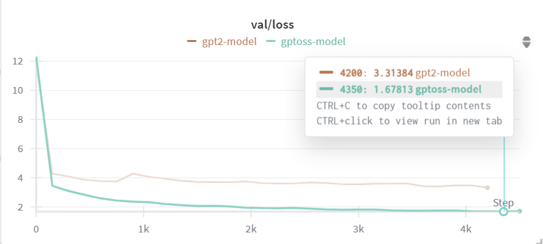

<div align="center">

# 📚 nano-GPT-OSS Language Model
</div>

**an open-source transformer that balances full-context and sliding-window attention for efficient, scalable LLM training and inference.**

<p align="center">
<a href="https://pytorch.org"></a>
<a href="https://huggingface.co"></a>
<a href="https://opensource.org/licenses/MIT"></a>
</p>

<div align="center">



</div>

## Dependencies
- [pytorch](https://pytorch.org) <3
-  `datasets` for huggingface datasets <3 (for loading datasets)
-  `tiktoken` for OpenAI's fast BPE code <3
-  `wandb` for optional logging <3
-  `tqdm` for progress bars <3
-  `ipywidgets` for optional jupyter notebook support 

## 📊 Dataset and Format

TinyStories can be found at [HuggingFace Datasets](https://huggingface.co/datasets/roneneldan/TinyStories).

### Data Fields:

Each story entry contains:

- `story`: The main story text
<details>
<summary>📝 Click to see example story</summary>

**Story:**

```
Once upon a time, there was a big, red ball that could bounce very high...
```

\[Rest of the example story\]

</details>

## 🚀 Installation

<details>
<summary>📦 Pip Installation</summary>

```bash
# clone project
git clone https://github.com/VizuaraAI/nano-gpt-oss
cd nano-gpt-oss

# [OPTIONAL] create conda environment
conda create -n myenv python=3.10
conda activate myenv

# install pytorch according to instructions
# https://pytorch.org/get-started/

# install requirements
pip install -r requirements.txt
```

</details>

## 🏃 How to Run
It automatically detect your GPU

Train model with default configuration:

if you want to train GPT-OSS model . Here is two options:
1. Terminal
2. Jupyter Notebook

### Terminal
you need to take some step

- open `Terminal`
- go inside project
- Run command 
```sh
python train.py
```

### Jupyter Notebook
you need to take some step

- Go inside project
- Launch Jupyter
- Open `trains.ipynb`
- Run all cell

you will get outputs
